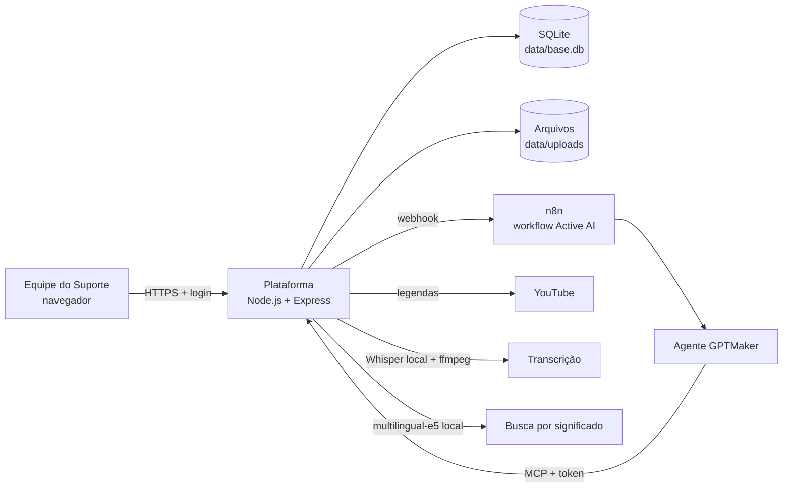
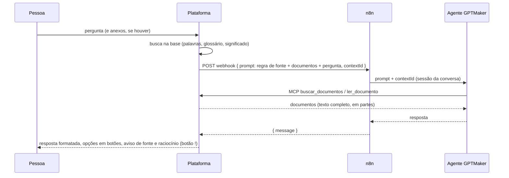

# 1. Visão geral e arquitetura

## O que a plataforma faz

| Área | Funções |
| --- | --- |
| **Conteúdo** | Textos em Markdown com editor visual, arquivos de qualquer tipo, vídeos e áudios enviados, vídeos do YouTube |
| **Organização** | Categorias com ícone, tags, descrição curta, prazo de revisão, glossário de termos e sinônimos |
| **Busca** | Por palavras (títulos, tags, descrições, conteúdo dos arquivos e transcrições, sem diferenciar acentos), pelos sinônimos do glossário e **por significado** (modelo no próprio servidor), num só resultado |
| **Active AI** | Resposta na busca, chat (base da plataforma primeiro, com aviso quando usa a base geral do GPT Maker), perguntas sobre um documento, anexos na conversa, raciocínio no **!**, resumo e capítulos de vídeos |
| **Qualidade da base** | Lacunas, avaliações 👍👎, histórico de versões, documentos para revisar, modelos de texto |
| **Acesso** | Login próprio (e-mail e senha), perfis *Administrador*, *Editor* e *Só consulta*, registro de quem criou e quem editou |

## Componentes

| Peça | Papel |
| --- | --- |
| **Plataforma** (`server/`) | Servidor web único: login, interface, API, banco, uploads, busca, transcrição, servidor MCP |
| **Interface** (`public/`) | Aplicação de página única (SPA) em JavaScript puro; rotas com `#/` no endereço |
| **SQLite** (`data/base.db`) | Documentos, categorias, versões, lacunas, avaliações, glossário, pessoas e sessões; índice de busca FTS5 e vetores da busca por significado |
| **Arquivos** (`data/uploads/`) | Os arquivos enviados, com nomes gerados pelo servidor |
| **n8n** | Recebe a pergunta da plataforma e repassa ao agente do GPTMaker (o mesmo workflow do chat da Active AI) |
| **GPTMaker** | O agente Active AI, com acesso à base pelo MCP. Ele também tem uma base própria (RAG do GPT Maker), usada só quando a plataforma não tem a resposta |
| **MCP** (`/mcp`) | Ferramentas para o agente buscar e ler documentos inteiros, consultar o glossário e registrar lacunas |
| **Whisper + ffmpeg** | Transcrição de vídeos e áudios no próprio servidor, sem enviar o áudio para fora |
| **multilingual-e5** | Modelo da busca por significado, no próprio servidor (nenhum texto sai da plataforma) |

## Fluxo de uma pergunta no chat

Pontos importantes:

- **A mensagem enviada ao agente é curta** (no máximo ~3.500 caracteres). O GPTMaker só enxerga ~4.000 caracteres por mensagem; por isso a plataforma nunca manda documentos inteiros na mensagem. Ela manda **referências** (id e título) e o agente lê o conteúdo completo pelo MCP.
- **A conversa é contínua**: cada conversa tem um `contextId` próprio, e o GPTMaker guarda o histórico por esse id.
- **Na busca e no chat**, a plataforma já pesquisa a base e manda ao agente as referências e trechos curtos dos documentos encontrados, com a regra de fonte: a base da plataforma primeiro; a base própria do GPT Maker só quando a plataforma não tiver a resposta, com aviso na tela.

## Fluxo de um vídeo

1. O vídeo é enviado (arquivo) ou o link do YouTube é colado.
2. A plataforma transcreve em segundo plano: arquivos com o **Whisper local**; YouTube com as **legendas do próprio YouTube**.
3. A transcrição vira o conteúdo pesquisável do item, com marcações de tempo `[hh:mm:ss]`.
4. A plataforma pede à Active AI um **resumo e capítulos** do vídeo.
5. O agente passa a responder sobre o vídeo lendo a transcrição pelo MCP, citando os minutos.

Detalhes em [4. Vídeos, transcrição e YouTube](04-videos-e-transcricao.md).

## Tipos de item

Tudo na base é um **item**, de um destes tipos:

| Tipo (`kind`) | O que é | Conteúdo pesquisável |
| --- | --- | --- |
| `article` | Texto escrito na plataforma (Markdown) | O próprio texto |
| `file` | Arquivo enviado (qualquer formato) | Texto extraído (PDF, Office, texto, HTML) ou a transcrição (vídeo/áudio) |
| `youtube` | Vídeo do YouTube (link) | A transcrição das legendas |

Cada pessoa tem uma conta (veja [11. Login](11-login-busca-e-glossario.md)); o autor e quem editou por último ficam registrados no item.

Além disso, os arquivos anexados no chat da Active AI são itens `file` **temporários** (somem das listas e expiram; veja o [guia de uso](02-guia-de-uso.md#anexar-arquivos-na-conversa)).
